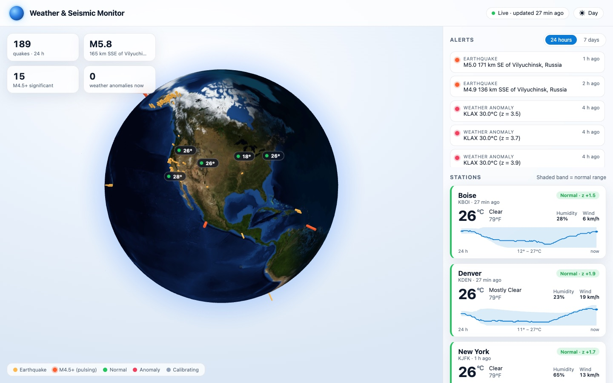
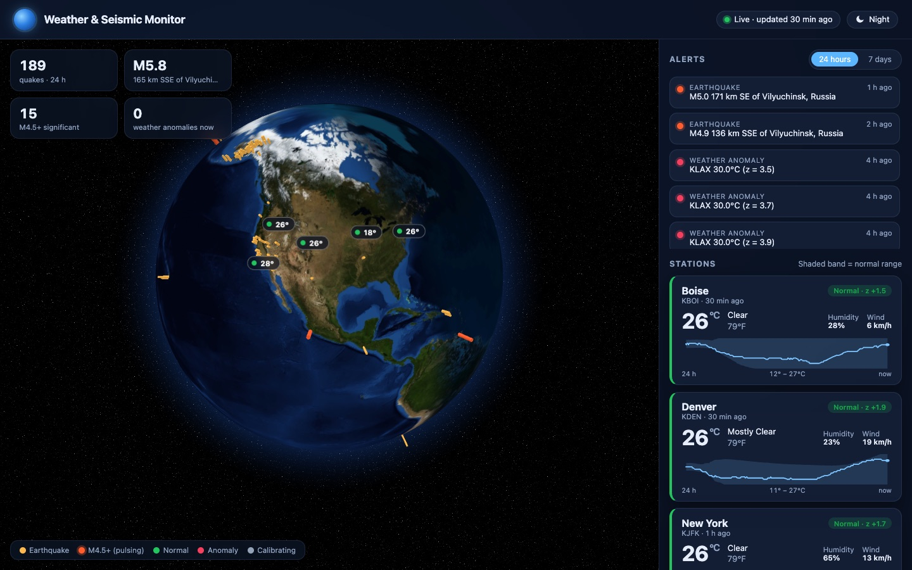
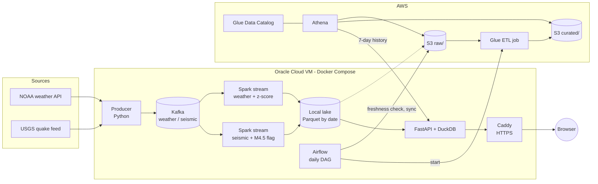

# Weather & Seismic Data Pipeline

An end-to-end streaming and batch data pipeline that ingests live NOAA weather
observations and USGS earthquakes, detects anomalies in real time, builds a
curated data lake on AWS, and serves it on a public dashboard.

**Live dashboard:** https://weather-seismic.duckdns.org



<details>
<summary>Night theme</summary>



</details>

## What it does

- Polls 5 NOAA weather stations and the USGS past-hour earthquake feed every minute.
- Streams readings through **Kafka** into **Spark Structured Streaming**, which parses,
  deduplicates and scores them in real time:
  - earthquakes of **M4.5+** are flagged as significant;
  - each weather reading gets a **z-score against its station's rolling 24-hour baseline**,
    flagged when |z| > 3.
- Writes date-partitioned **Parquet** to a local lake, synced to an **S3** raw zone.
- A nightly **Airflow** DAG checks data freshness, syncs to S3 and runs an idempotent
  **AWS Glue** job that compacts, deduplicates and aggregates each day into a curated zone.
- **Athena** queries both zones through the **Glue Data Catalog** using partition projection.
- A **FastAPI + DuckDB** API and a **React** dashboard (3D globe with the real day/night
  terminator) serve live and historical data over HTTPS.

## Architecture



**Streaming** (always on) handles what's happening *now*: anomaly flags within about a
minute. **Batch** (nightly) handles *quality*: one compact file per day, the latest
revision of each quake, and daily summaries.

## Tech stack

| Layer | Tools |
|---|---|
| Ingestion | Python, `requests`, `confluent-kafka` |
| Messaging | Apache Kafka 3.8 (KRaft, single broker) |
| Stream processing | Spark 4.1 Structured Streaming (PySpark) |
| Storage | Parquet, Amazon S3 (raw / curated zones) |
| Batch ETL | AWS Glue 5.0 (PySpark) |
| Catalog & query | Glue Data Catalog, Amazon Athena |
| Orchestration | Apache Airflow 3.3 |
| Serving | FastAPI, DuckDB, React 19, react-globe.gl / three.js, Caddy |
| Infrastructure | Docker Compose on an Oracle Cloud ARM VM, IAM least-privilege users |

## Design decisions

- **At-least-once delivery, deduplicated downstream.** The producer resends after
  restarts; Spark drops duplicates with a 3-hour watermark so streaming state stays
  bounded, and the Glue job removes anything left over.
- **Checkpoints and replay.** Spark checkpoints its Kafka offsets, so restarts resume
  exactly where they stopped. After logic changes, deleting the lake and its
  checkpoint together replays everything from Kafka.
- **Detection that knows when it can't judge.** A station is only scored when its
  baseline has at least 12 readings covering 18 of the previous 24 hours. Without this,
  gaps in collection made ordinary afternoons look anomalous (see below).
- **Idempotent batch jobs.** The Glue job processes one day and overwrites only that
  day's partition (dynamic partition overwrite), so retries and backfills never
  duplicate data. Airflow runs one DAG run at a time because the Glue job allows one
  concurrent run.
- **Partition projection** instead of crawlers: new days are queryable in Athena as
  soon as they land, with no catalog updates.
- **Cost control.** Athena workgroup with a 100 MB per-query scan limit; dashboard
  history queries read the compacted curated tables (≈14 files instead of ≈1,400) and
  are cached for 10 minutes, so Athena cost stays around $0.30/month regardless of
  traffic. Glue jobs have a 10-minute timeout.
- **Least privilege.** Separate IAM users for the pipeline server (upload to `raw/`,
  run one Glue job) and the public dashboard (read curated data, run Athena queries).
  Only the dashboard is exposed publicly; Airflow, Kafka UI and Spark UI are reachable
  only through SSH tunnels.

## Lessons from building it

- **The first detector produced 15 false positives.** Investigation showed the laptop
  sleeping had left the baselines made almost entirely of night-time readings, so
  normal afternoons scored z > 3. Fixed with the baseline-coverage rule, verified with
  a synthetic-data test (an isolated Kafka topic and lake, with known expected results),
  and made permanent by moving the pipeline to an always-on server.
- **Many bugs failed silently rather than crashing**: a schema field typo producing
  NULL columns, an empty `requirements.txt` causing a container crash loop, a
  misnamed DAG folder mounted as an empty directory, a container user ID (1000) that
  couldn't read credentials owned by UID 1001. Checking the actual output, not just
  that a step "succeeded", caught each one.
- **Small files are a real cost.** Streaming wrote hundreds of tiny Parquet files per
  day; lowering shuffle partitions and compacting in the batch layer cut both query
  time and S3 request costs.

## Repository layout

| Path | Contents |
|---|---|
| `phase0/` | First exploration of the NOAA and USGS APIs |
| `phase1/` | Kafka producer and its Dockerfile |
| `phase2/` | Spark streaming jobs: `weather_stream.py`, `seismic_stream.py` |
| `phase3/` | Synthetic data generator for testing the anomaly detector |
| `phase4/` | S3 sync script, Glue ETL job, job-creation script |
| `phase5/` | Athena DDL (tables, projection, `alerts` view) and analytical queries |
| `phase6/` | Airflow image, the `daily_lake_maintenance` DAG, pipeline IAM policy |
| `phase7/` | Dashboard IAM policy |
| `api/` | FastAPI + DuckDB dashboard API |
| `frontend/` | React dashboard and Caddy configuration |
| `docker-compose.yml` | Every service: Kafka, producer, Spark jobs, Airflow, API, web |

## Running it

Requires Docker, an AWS account (S3, Glue, Athena) and two server-only files that
are not in the repository:

- `.env` — `AIRFLOW_UID` (the host user's ID) and `SITE_ADDRESS` (the public domain)
- `.env.dashboard` — AWS keys for the read-only dashboard user

```bash
mkdir -p data
docker compose up -d --build
```

The AWS side is defined in code: `phase4/create_glue_job.sh`, the SQL in
`phase5/ddl/`, and the IAM policies in `phase6/iam/` and `phase7/iam/`.

## Data sources

Weather observations from the [NOAA National Weather Service API](https://www.weather.gov/documentation/services-web-api),
earthquakes from the [USGS real-time feeds](https://earthquake.usgs.gov/earthquakes/feed/),
Earth imagery from NASA.
