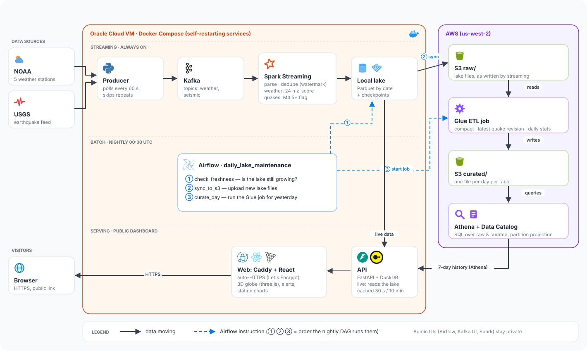

# High-Level Design — Weather & Seismic Data Pipeline

| | |
|---|---|
| **System** | Real-time weather and earthquake pipeline with anomaly detection |
| **Live** | https://weather-seismic.duckdns.org |
| **Detailed design** | [LLD.md](LLD.md) |



---

## 1. Purpose

Ingest live public data — NOAA weather observations and USGS earthquakes — every
minute; flag unusual events within about a minute of them happening; keep a
complete, cleaned, queryable history in a cloud data lake; and present it on a
public dashboard.

## 2. Requirements

### Functional
| ID | Requirement |
|---|---|
| F1 | Poll 15 NOAA weather stations and the USGS past-hour earthquake feed every 60 s. |
| F2 | Flag earthquakes of magnitude ≥ 4.5 as significant. |
| F3 | Flag weather readings that are unusual for that station **at that time of day**. |
| F4 | Store every reading permanently, partitioned by date, in a cloud data lake. |
| F5 | Produce a curated layer: deduplicated readings, the latest version of each quake, daily per-station summaries. |
| F6 | Make all data queryable with SQL. |
| F7 | Show live stations, recent quakes and alerts (24 h and 7 days) on a public web page. |

### Non-functional
| ID | Requirement | How it's met |
|---|---|---|
| N1 | **Freshness:** anomalies visible within ~1–2 min | 60 s polling, 1-minute micro-batches, 30 s API cache |
| N2 | **No data loss** across crashes and restarts | Kafka buffering, Spark checkpoints, `flush()` on shutdown, self-restarting containers |
| N3 | **Correctness** | At-least-once delivery + deduplication at three layers; idempotent batch jobs |
| N4 | **Cost** under a few dollars a month | Free-tier VM, partition/column pruning, compacted curated layer, query caching, Glue timeouts |
| N5 | **Security** | Least-privilege IAM per component, OIDC for CI, private admin UIs, HTTPS, rate limiting |
| N6 | **Operability** | One-command deploys via CI/CD, freshness checks, smoke tests, loud failures on empty input |

## 3. System context

```
                         ┌──────────────────────────────┐
   NOAA weather API ───► │                              │ ───► Public dashboard (HTTPS)
   USGS quake feed  ───► │  Weather & Seismic Pipeline  │ ───► SQL users (Athena)
                         │                              │ ───► Data scientists (curated S3)
   GitHub (code)    ───► │                              │
                         └──────────────────────────────┘
```

## 4. Architecture overview

Three lanes run side by side (see diagram):

1. **Streaming (always on, on the VM)** — producer → Kafka → Spark Structured
   Streaming → local Parquet lake. Cleans, deduplicates and scores every reading
   about a minute after it's published.
2. **Batch (nightly, orchestrated by Airflow)** — freshness check → sync the lake to
   S3 `raw/` → AWS Glue curates yesterday into S3 `curated/`. Optimises for quality:
   compaction, final quake revisions, daily summaries.
3. **Serving (on demand)** — FastAPI reads the live lake with DuckDB and 7-day
   history from Athena; Caddy serves the React dashboard over HTTPS and rate-limits
   the API.

A fourth, out-of-band flow — **CI/CD** in GitHub Actions — tests every change and
deploys `main` to the VM and the Glue script to S3.

This is a **lambda-style** design: a speed layer for "now" and a batch layer for
"correct and tidy", both reading from the same raw events.

## 5. Components

| Component | Technology | Responsibility | Runs |
|---|---|---|---|
| Producer | Python, confluent-kafka | Poll APIs, clean records, skip repeats, publish to Kafka | VM container |
| Message broker | Apache Kafka 3.8 (KRaft) | Durable buffer between ingest and processing; replay | VM container |
| Weather stream | Spark 4.1 Structured Streaming | Parse, dedupe, seasonal anomaly scoring, write lake | VM container |
| Seismic stream | Spark 4.1 Structured Streaming | Parse, dedupe, M4.5+ flag, write lake | VM container |
| Local lake | Parquet on disk | Date-partitioned raw data + Spark checkpoints | VM disk |
| Orchestrator | Apache Airflow 3.3 (self-hosted) | Nightly: freshness check, S3 sync, start Glue | VM container |
| Raw zone | Amazon S3 `raw/` | Permanent cloud copy of the lake | AWS |
| Batch ETL | AWS Glue 5.0 (PySpark) | Curate one day: dedupe, latest revisions, summaries, compaction | AWS |
| Curated zone | Amazon S3 `curated/` | Clean, compact, analysis-ready tables | AWS |
| Catalog | AWS Glue Data Catalog | Table definitions (location, schema, partitions) | AWS |
| Query engine | Amazon Athena | SQL over raw and curated; partition projection | AWS |
| API | FastAPI + DuckDB | Live data from the lake; cached 7-day history from Athena | VM container |
| Web | Caddy + React (three.js globe) | HTTPS, static site, API proxy, rate limit | VM container |
| CI/CD | GitHub Actions | Lint, tests, builds; OIDC Glue upload; SSH deploy + smoke test | GitHub |

## 6. Data flow

**One weather reading, end to end**

1. NOAA publishes an observation → the producer fetches it (≤ 60 s), flattens it to
   a small JSON record and sends it to Kafka topic `weather`, keyed by station.
2. Spark's next micro-batch (≤ 1 min) parses it, drops it if it's a duplicate,
   compares it with the same station's readings at the same hour on the previous
   14 days, scores it, and appends it to `lake/weather/date=YYYY-MM-DD/`.
3. The API serves it to the dashboard (≤ 30 s cache).
4. At 00:30 UTC the next night, Airflow syncs the file to S3 `raw/` and Glue writes
   the cleaned day to `curated/`; from then on it's in Athena and the 7-day view.

**Earthquakes** follow the same path through the `seismic` topic and stream; USGS
revisions of a quake are kept in raw and reduced to the latest one in curated.

## 7. Key design decisions

| Decision | Alternatives considered | Why |
|---|---|---|
| Kafka between producer and Spark | Producer writes files directly | Buffering through outages, replay after logic changes, decoupling |
| At-least-once + dedup downstream | Exactly-once end to end | Much simpler; duplicates removed by watermark dedup and again in Glue |
| Same-hour median/MAD detector | Rolling 24 h mean/std; ML models | Removes the daily-cycle false positives; robust to outliers; explainable |
| Local lake + nightly sync to S3 | Spark writes straight to S3 | Detector re-reads 14 days of history every minute — free locally, costly from S3 |
| Parquet partitioned by event date | JSON/CSV; processing-date partitions | Columnar pruning; late data and revisions land in the right day |
| Partition projection | Glue crawlers | New days queryable immediately in Athena, no crawler cost |
| Glue reads S3 paths directly | Glue reads via catalog | Projection is Athena-only; catalog reads missed new days silently |
| Athena (serverless) | Redshift | Pay per query at small volume; no cluster |
| DuckDB for live API reads | Athena for everything | Milliseconds and free for the live view; Athena kept for history |
| Self-hosted Airflow on the VM | AWS MWAA | Free; MWAA has a standing cost |
| Oracle Cloud Always Free VM | Laptop; AWS EC2 | Always on (laptop sleep caused data gaps); free |
| GitHub OIDC for AWS access in CI | Long-lived IAM keys in GitHub | No stored secrets; access limited to `main` of this repo |

## 8. Deployment view

```
Oracle Cloud A1 VM (4 ARM CPUs, 24 GB, Ubuntu 24.04) — Docker Compose
  kafka · kafka-ui · producer · weather-stream · seismic-stream · spark (shell)
  airflow · airflow-postgres · api · web (Caddy)          restart: unless-stopped
  Public: 80/443 (Caddy) · SSH 22 · everything else bound to 127.0.0.1

AWS us-west-2
  S3 bucket weather-seismic-lake-mahendra: raw/ curated/ scripts/ athena-results/
  Glue job curate-daily · Glue Data Catalog weather_seismic · Athena workgroup weather-seismic

GitHub
  Actions workflow ci-cd.yml → OIDC role (S3 scripts/) and SSH deploy to the VM
```

## 9. Security

- **Network:** only Caddy (80/443) and SSH are reachable; Airflow, Kafka UI and Spark
  UIs bind to localhost and are accessed via SSH tunnels.
- **Identity:** separate least-privilege identities — `pipeline-vm` (upload `raw/`,
  run one Glue job), `dashboard-reader` (Athena + read `curated/`), Glue service role,
  GitHub OIDC role (write one S3 object). The admin user is used only from the
  developer's laptop.
- **Secrets:** server-only `.env` files and `~/.aws`, git-ignored; CI has no AWS keys.
- **Edge:** HTTPS (Let's Encrypt via Caddy), HSTS and security headers, API rate
  limit of 120 requests/min per IP; the API is read-only and validates inputs.

## 10. Reliability and scalability

| Concern | Today | At larger scale |
|---|---|---|
| Process crash | Docker restarts it; Spark resumes from checkpoint | Same |
| Server reboot | All services return automatically (tested) | Same |
| Pipeline stalls | Airflow freshness check fails; dashboard shows "Delayed" | + paging (PagerDuty/heartbeat monitor) |
| Single VM / broker / disk | Single points of failure | Managed Kafka (3 brokers, RF 3), Spark writing to S3/Iceberg, multi-node compute |
| Throughput | A few messages/min | More partitions keyed by station; cluster Spark; async producer |

## 11. Cost

| Item | Monthly |
|---|---|
| Oracle VM | $0 (Always Free) |
| S3 storage + requests | cents |
| Glue (1 run/night, ~90 s, 2 workers) | ~$1 |
| Athena (cached, curated tables) | ~$0.30, independent of traffic |
| Budgets | alerts at $0.01 and $5 |

## 12. Known limitations

- Single VM, single Kafka broker, lake on one disk — not highly available.
- The `foreachBatch` path is at-least-once; residual duplicates are removed in batch.
- Kafka retention is 7 days; replays beyond that rebuild from S3 `raw/` instead.
- New stations are "calibrating" until they have 5 days of same-hour history.
- No paging yet: failures are visible in Airflow, GitHub Actions and the dashboard.
